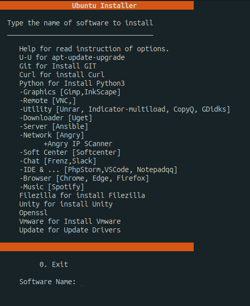

# UTU_After_Install
UTU_After_Install is  a time-saving script for Ubuntu users. After installing Ubuntu, you no longer need to spend time writing a bunch of code to set up your desired software packages. You can effortlessly install a variety of essential software just by writing their name. Stay tuned for updates and additional features.

